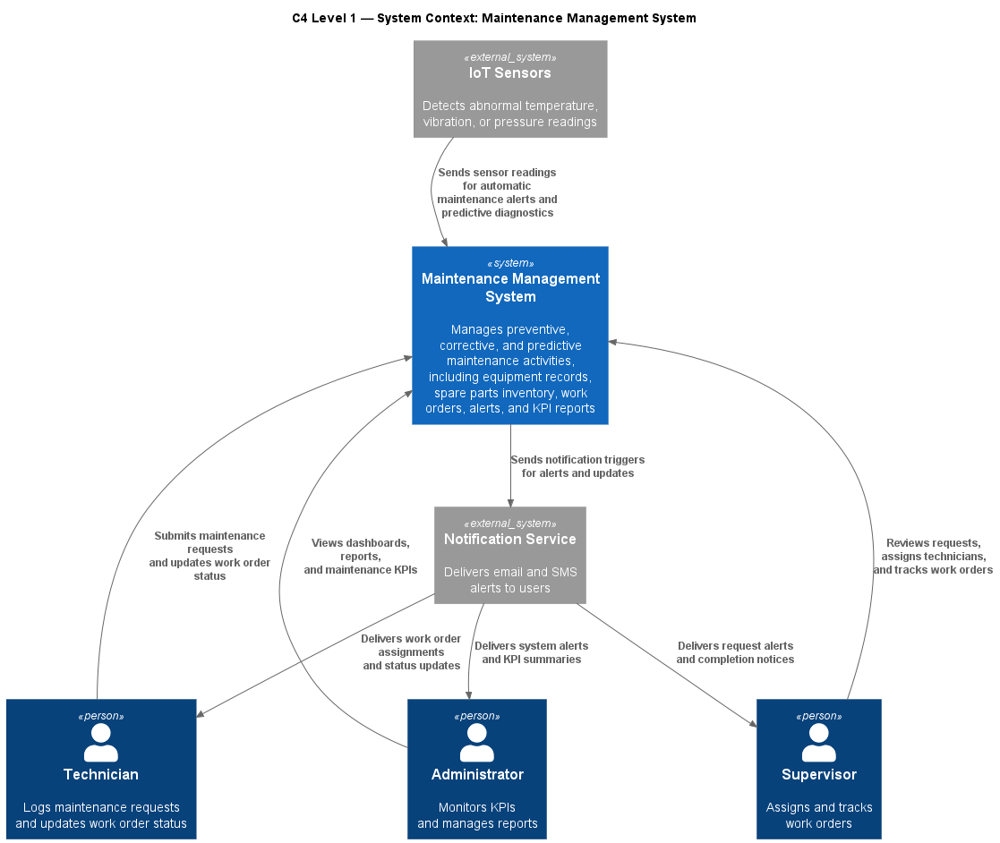
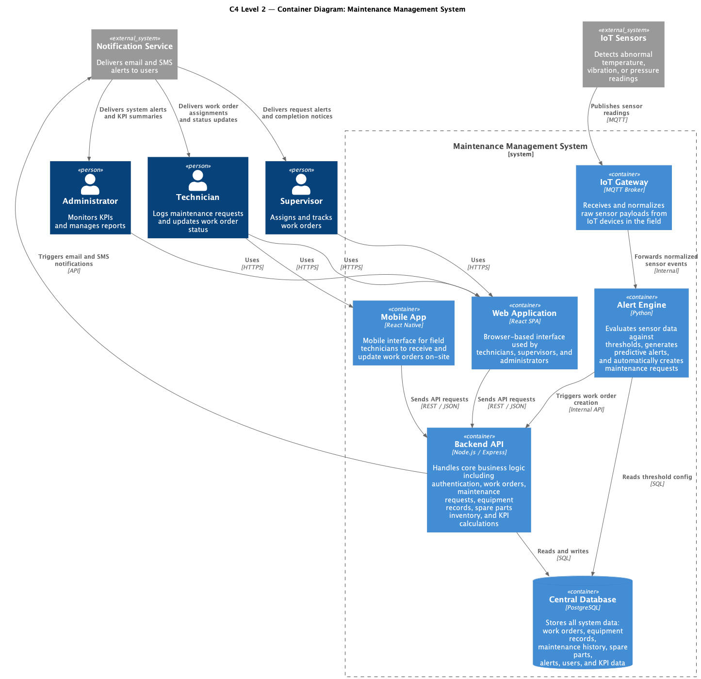
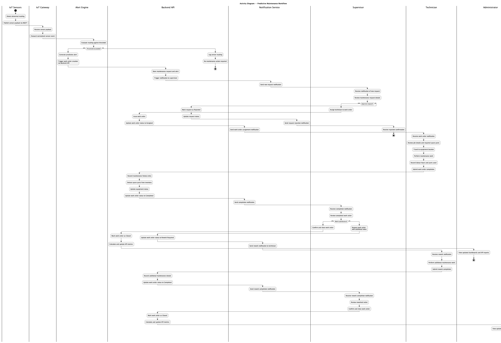
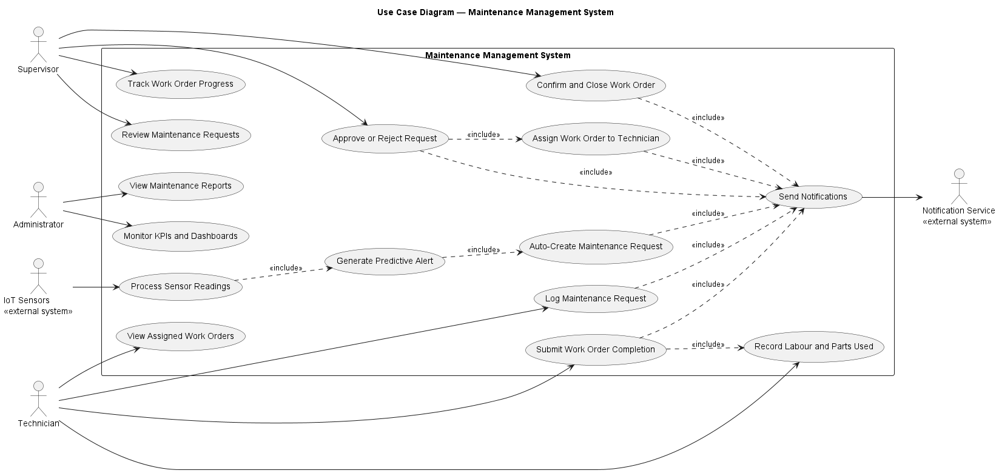
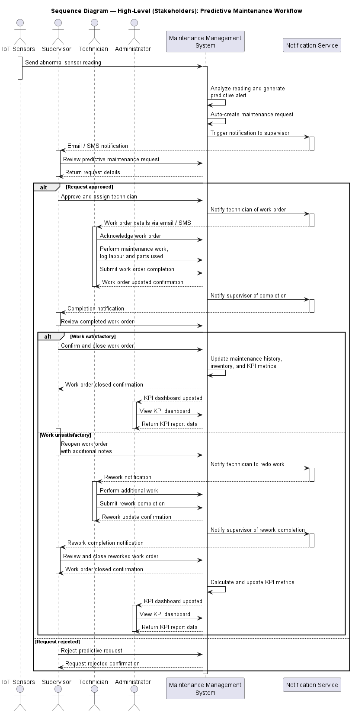
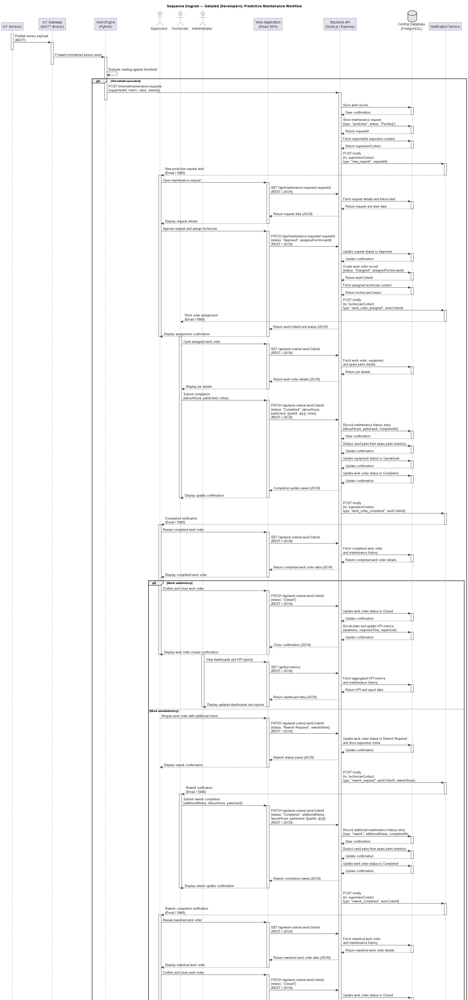

## C4 Level 1 Context Diagram

## C4 Level 2 Container Diagram

## Activity Diagram

## Use Case Diagram

## Sequence Diagram — High-Level Stakeholders

## Sequence Diagram — Detailed Developers

