# Maintenance Management System (MMS)
## Software Engineering Project Report

**Group Number:** 01  
**Course:** Software Engineering  
**Semester:** Spring 2026  
**Instructor:** Dr. Samer Elkababji  

## Group Members

| Student ID | Name | Commit Count |
|---|---|---:|
| 20210611 | Osama | 15 |
| 20210748 | Mira | 21 |
| 20210853 | Zina | 1 |
| 20220637 | Zakarea | 1 |

**GitHub Repository URL:**  
https://github.com/xalameen8633-dotcom/Software-engineering-project

**Version Information:**

v1.0.0 — First tagged version (April 25, 2026)  
v2.0.0 — Final report version (May , 2026)

---

# 1. Project Overview

## 1.1 System Purpose

The Maintenance Management System (MMS) is designed to help organizations carry out maintenance activities more efficiently. It allows technicians to submit maintenance requests, supervisors to assign and monitor tasks, and administrators to evaluate overall system performance.
The system supports both manual requests and automatic alerts generated by IoT sensors. This helps reduce equipment downtime and ensures faster response to potential issues.

---

## 1.2 System Scope

The system includes several key functionalities that support maintenance operations:

- Managing maintenance requests, whether they are created manually by technicians or automatically through IoT sensors.
- Creating, assigning, and tracking work orders to ensure tasks are completed efficiently.
- Monitoring equipment status using IoT sensors to detect potential issues early.
- Recording maintenance history and logging all related activities for future reference.
- Managing spare parts inventory to ensure availability during maintenance tasks.
- Generating KPI reports such as downtime, response time, and maintenance costs.
- Sending notifications and alerts to keep users informed about requests, updates, and system events.

---

# 2. Context Diagrams and Activity Diagrams

## 2.1 Context Diagram

The Context Diagram defines the overall boundary of the Maintenance Management System (MMS) and shows how it interacts with different users and external systems.
It provides a high-level view of the system, highlighting how MMS acts as the central platform that connects all actors and manages maintenance operations.

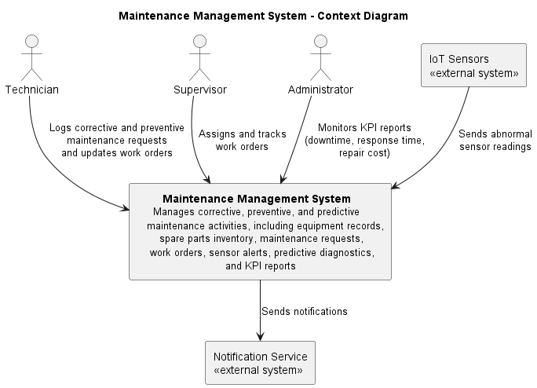

All entities interacting with MMS are categorized based on their roles:

### 1. Internal Actors 

- **Technician**: Logs maintenance requests, updates work orders, and records maintenance activities.
- **Supervisor**: Reviews maintenance requests, assigns technicians, tracks work order progress, and evaluates completed work.
- **Administrator**: Monitors system performance through KPI reports such as downtime, response time, and repair cost.

### 2. External Systems

- **IoT Sensors**: Continuously monitor equipment conditions and send abnormal readings to the system for predictive maintenance.
- **Notification Service**: Sends system-generated alerts and notifications, including maintenance requests, work order updates, and sensor alerts.

The context diagram clearly shows the role of MMS as a central system that coordinates communication between users and external services. It helps in understanding how information flows into and out of the system,ensuring that all interactions are properly managed.

---

## 2.2 Container Diagram

The Container Diagram presents a high-level view of the internal structure of the Maintenance Management System (MMS).It shows how the system is divided into major components and how these components interact with each other.

This diagram helps in understanding how responsibilities are distributed across the system and how data flows between different parts.

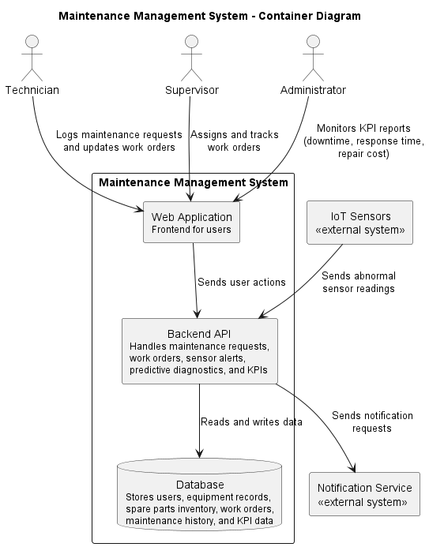

The system is composed of the following main containers:

### 1. Web Application (Frontend)

- Provides the user interface for technicians, supervisors, and administrators.
- Allows users to log maintenance requests, assign and track work orders, update work orders, and view KPI reports.

### 2. Backend API (Application Server)

- Handles business logic and system processing.
- Manages workflows such as maintenance request handling, work order creation, sensor alert processing, predictive diagnostics, and KPI calculations.
- Coordinates communication between the frontend, database, IoT sensors, and notification service.

### 3. Database

- Stores system data including:
  - Users
  - Equipment records
  - Maintenance requests
  - Work orders
  - Maintenance history
  - Spare parts inventory
  - KPI data

### 4. External Systems

- **IoT Sensors**: Send real-time equipment readings for predictive maintenance.
- **Notification Service**: Sends alerts and system notifications to users.

The container diagram illustrates how the system follows a layered architecture,where each component has a specific responsibility. The frontend handles user interaction, the backend manages logic and processing, and the database stores all system data.
This separation improves system organization, scalability, and maintainability.

---

## 2.3 Activity Diagram

The activity diagram illustrates the overall workflow of the maintenance process,including both manual and sensor-driven activities. It shows how tasks move between different roles and how the system manages each step from request creation to completion.
This diagram helps in understanding the sequence of operations and the responsibilities of each actor involved in the process.

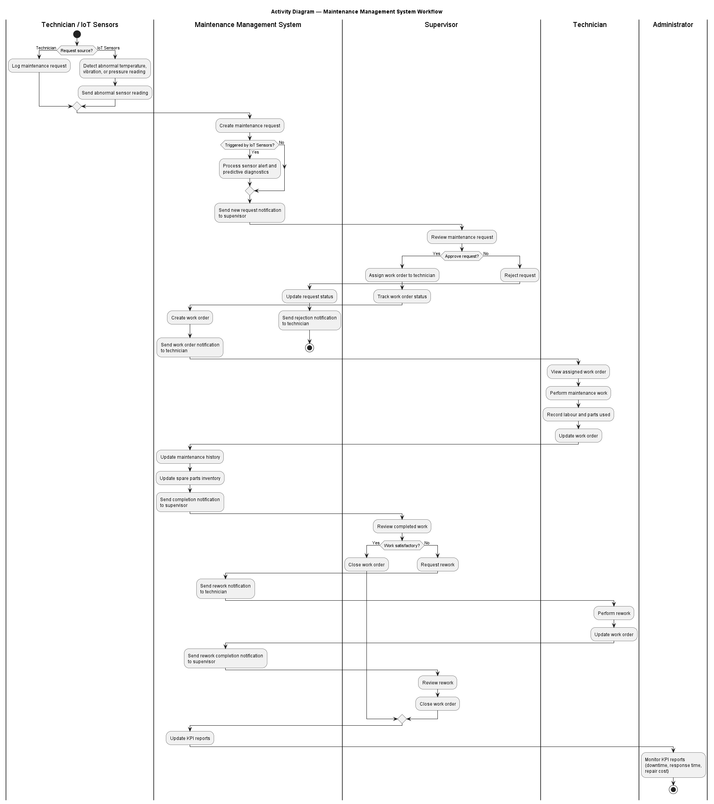

### Key Activities

1. A maintenance request is generated manually by a technician or automatically through abnormal IoT sensor readings.
2. The system creates the maintenance request and sends a notification to the supervisor.
3. The supervisor reviews the request and either approves or rejects it.
4. If approved, the supervisor assigns the work order to a technician and tracks its progress.
5. The technician performs the maintenance work and updates the work order.
6. The system updates maintenance history and spare parts inventory.
7. The supervisor reviews the completed work and either closes the work order or requests rework.
8. The system updates KPI reports, which are monitored by the administrator.

This process ensures that each maintenance request is properly reviewed before being carried out. It also improves accountability, as each step is handled by a specific role such as a technician, supervisor, or the system.
Additionally, the use of IoT devices allows the system to automatically detect potential issues without requiring manual input, enabling faster response and more efficient maintenance.
Overall, the activity diagram ensures that the maintenance process is structured and consistent. It also highlights how the system supports both manual and automated workflows, improving efficiency and reducing delays in maintenance operations.

---

# 3. Use Case Models and Interaction Design

## 3.1 Use Case Diagram

The use case diagram illustrates how different actors interact with the Maintenance Management System (MMS) to perform key operations. It provides a clear overview of the system’s functionality from the user’s perspective.
This diagram helps in identifying the main system features and shows how each actor,such as technicians, supervisors, and administrators, is involved in different tasks within the system.

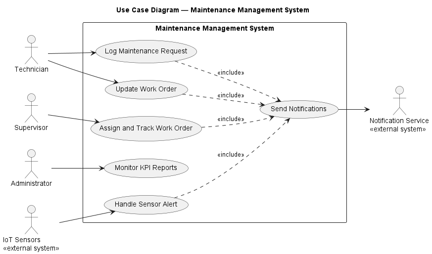

The diagram identifies the core system functionalities and how each actor interacts with them. The main use cases are logging maintenance requests, assigning and tracking work orders, updating work orders, handling sensor alerts, and monitoring KPI reports.

---

## 3.2 Use Case Descriptions

### UC1 — Log Maintenance Request

| Field | Description |
|---|---|
| **Use Case ID** | UC1 |
| **Use Case Name** | Log Maintenance Request |
| **Actor(s)** | Technician |
| **Description** | A technician logs a maintenance request for equipment that needs preventive or corrective maintenance. |
| **Preconditions** | Technician is authenticated. Equipment record exists in the system. |
| **Postconditions** | Maintenance request is stored and supervisor is notified. |
| **Main Flow** | 1. Technician enters request details. 2. System stores the maintenance request. 3. System sends a new request notification to the supervisor. 4. Technician receives confirmation. |
| **Extensions** | Invalid or missing request details → system shows an error → technician corrects and resubmits. |
| **Includes** | Send Notifications |

This use case is important because it ensures that maintenance tasks are properly initiated and managed, forming the foundation of the overall maintenance workflow.

---

### UC2 — Assign and Track Work Order

| Field | Description |
|---|---|
| **Use Case ID** | UC2 |
| **Use Case Name** | Assign and Track Work Order |
| **Actor(s)** | Supervisor |
| **Description** | A supervisor assigns a work order to a technician and tracks its status. |
| **Preconditions** | Supervisor is authenticated. A maintenance request exists. |
| **Postconditions** | Work order is created, technician is notified, and work order status can be tracked. |
| **Main Flow** | 1. Supervisor selects a maintenance request. 2. Supervisor assigns the work order to a technician. 3. System creates the work order. 4. System sends a work order notification to the technician. 5. Supervisor tracks the work order status. |
| **Extensions** | Request is rejected → system updates request status and sends rejection notification to technician. |
| **Includes** | Send Notifications |

This use case is important because it ensures that maintenance tasks are properly initiated and managed, forming the foundation of the overall maintenance workflow.

---

### UC3 — Update Work Order

| Field | Description |
|---|---|
| **Use Case ID** | UC3 |
| **Use Case Name** | Update Work Order |
| **Actor(s)** | Technician |
| **Description** | A technician updates an assigned work order to show progress or completion. |
| **Preconditions** | Technician is authenticated. Work order is assigned to the technician. |
| **Postconditions** | Work order, maintenance history, and spare parts inventory are updated. Supervisor is notified. |
| **Main Flow** | 1. Technician enters work order update. 2. System updates the work order. 3. System updates maintenance history and spare parts inventory. 4. System sends a completion notification to the supervisor. 5. Technician receives confirmation. |
| **Extensions** | Missing update details → system shows an error → technician corrects and resubmits. |
| **Includes** | Send Notifications |

This use case plays a key role in maintaining system efficiency by ensuring that tasks are completed, monitored,and evaluated effectively.

---

### UC4 — Handle Sensor Alert

| Field | Description |
|---|---|
| **Use Case ID** | UC4 |
| **Use Case Name** | Handle Sensor Alert |
| **Actor(s)** | IoT Sensors |
| **Description** | IoT sensors send readings to the system. If the reading is abnormal, the system creates a sensor alert and maintenance request. |
| **Preconditions** | IoT sensors are active. Equipment record exists in the system. |
| **Postconditions** | If abnormal, sensor alert and maintenance request are stored, and supervisor is notified. |
| **Main Flow** | 1. IoT sensors send sensor reading. 2. System checks the sensor threshold. 3. If reading is abnormal, system stores sensor alert. 4. System creates maintenance request. 5. System sends sensor alert notification to supervisor. |
| **Extensions** | Normal reading → system stores the sensor reading only and no alert is created. |
| **Includes** | Send Notifications |

This use case plays a key role in maintaining system efficiency by ensuring that tasks are completed, monitored,and evaluated effectively.

---

### UC5 — Monitor KPI Reports

| Field | Description |
|---|---|
| **Use Case ID** | UC5 |
| **Use Case Name** | Monitor KPI Reports |
| **Actor(s)** | Administrator |
| **Description** | Administrator monitors KPI reports such as downtime, response time, and repair cost. |
| **Preconditions** | Administrator is authenticated. Maintenance data exists in the system. |
| **Postconditions** | KPI reports are displayed to the administrator. |
| **Main Flow** | 1. Administrator opens KPI dashboard. 2. System reads maintenance data. 3. System calculates KPIs. 4. System displays KPI reports. |
| **Extensions** | No maintenance data available → system displays an empty KPI report message. |
| **Includes** | None |

This use case plays a key role in maintaining system efficiency by ensuring that tasks are completed, monitored,and evaluated effectively.
---

# 4. Sequence Diagrams

## 4.1 High-Level Sequence Diagrams (Stakeholders)

These sequence diagrams illustrate interactions between users and the system at a high level. They focus on the main actor, the Maintenance Management System, and external services such as the Notification Service.

### UC1 — Log Maintenance Request

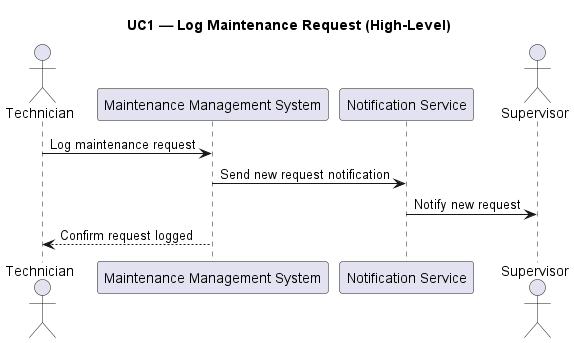

The UC1 high-level sequence diagram shows how a technician logs a maintenance request. The system receives the request, sends a new request notification to the supervisor, and confirms the request to the technician.

---

### UC2 — Assign and Track Work Order

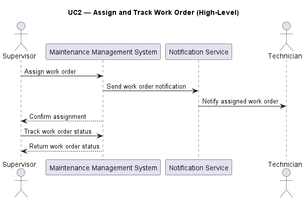

The UC2 high-level sequence diagram shows how the supervisor assigns a work order and tracks its status. The system sends a work order notification to the technician and returns work order status information to the supervisor.

---

### UC3 — Update Work Order

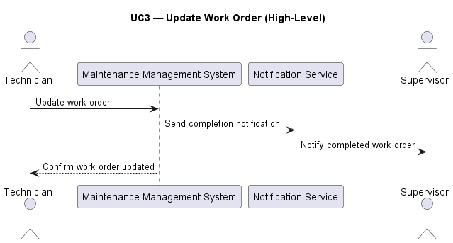

The UC3 high-level sequence diagram shows how the technician updates the work order after maintenance is completed. The system sends a completion notification to the supervisor and confirms the update to the technician.

---

### UC4 — Handle Sensor Alert

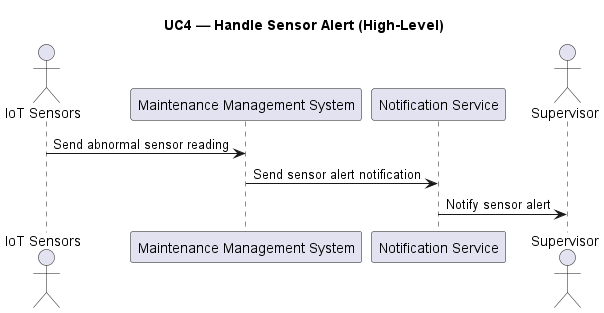

The UC4 high-level sequence diagram shows how IoT sensors send abnormal readings to the system. The system sends a sensor alert notification to the supervisor through the Notification Service.

---

### UC5 — Monitor KPI Reports

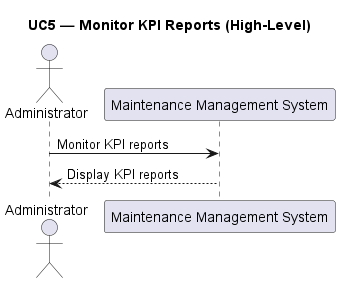

The UC5 high-level sequence diagram shows how the administrator requests KPI reports from the system and receives the displayed KPI report results.

---

## 4.2 Detailed Sequence Diagrams (Developers)

The detailed sequence diagrams provide a developer-level view of system interactions. These diagrams include internal components such as:

- Web Application
- Backend API
- Database
- Notification Service

They show validation, database operations, system processing, and notification handling.

### UC1 — Log Maintenance Request

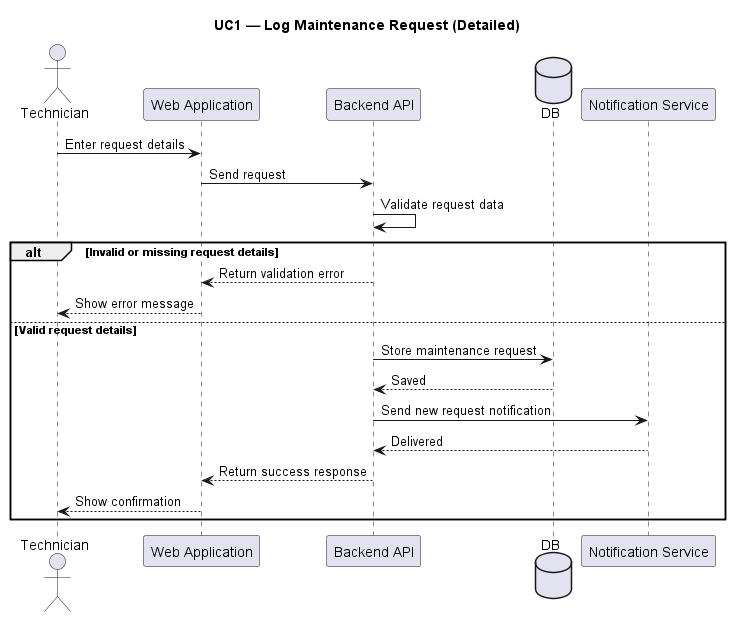

The UC1 detailed sequence diagram shows how the Web Application sends the request to the Backend API, how the request is validated, stored in the database, and how the Notification Service is triggered when the request is valid.

---

### UC2 — Assign and Track Work Order

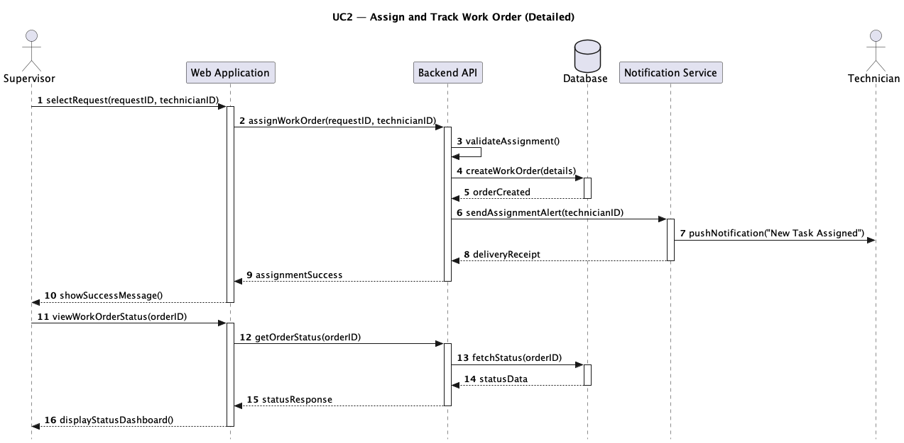

The UC2 detailed sequence diagram shows how the supervisor assigns a work order through the Web Application. The Backend API creates the work order in the database, triggers a notification, and later retrieves work order status for tracking.

---

### UC3 — Update Work Order

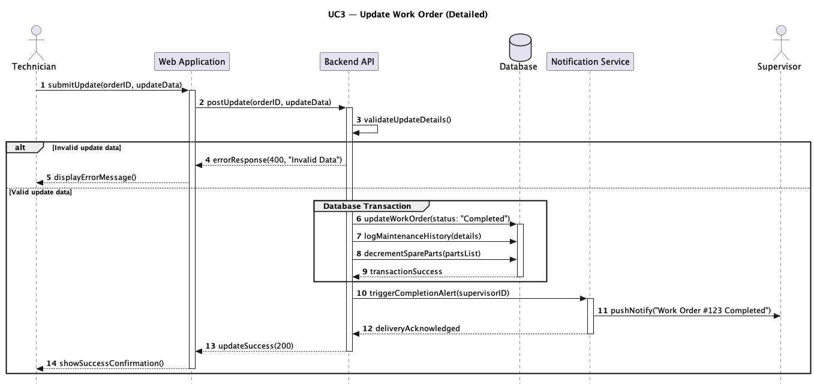

The UC3 detailed sequence diagram shows how the technician updates a work order. The Backend API updates the work order, maintenance history, and spare parts inventory before sending a completion notification.

---

### UC4 — Handle Sensor Alert

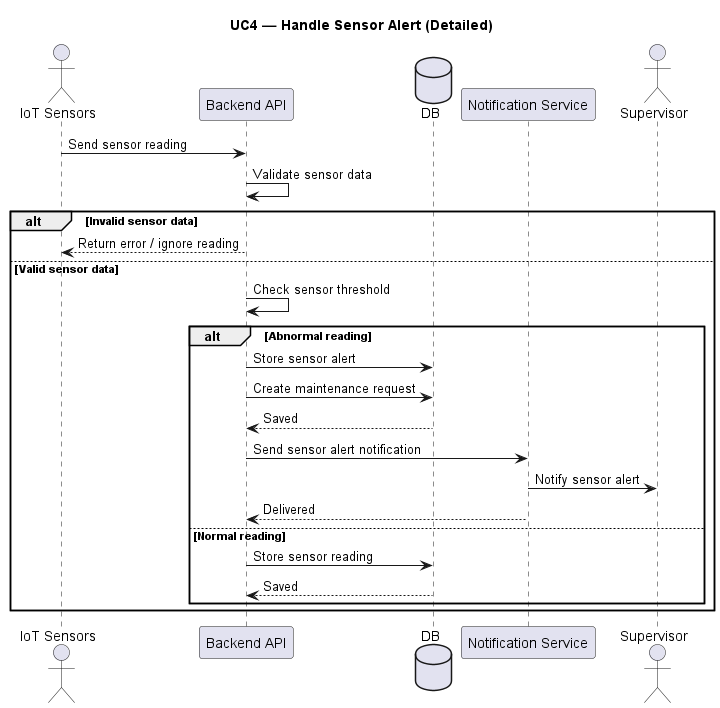

The UC4 detailed sequence diagram shows how sensor readings are checked against thresholds. If the reading is abnormal, the system stores a sensor alert, creates a maintenance request, and sends a sensor alert notification. If the reading is normal, the system stores the reading only.

---

### UC5 — Monitor KPI Reports

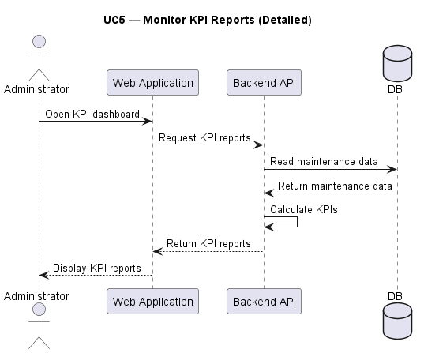

The UC5 detailed sequence diagram shows how the administrator opens the KPI dashboard. The system reads maintenance data from the database, calculates KPIs, and returns KPI reports to the Web Application.

---

# 5. Class Diagram (Structure)

The class diagram represents the static structure of the system.

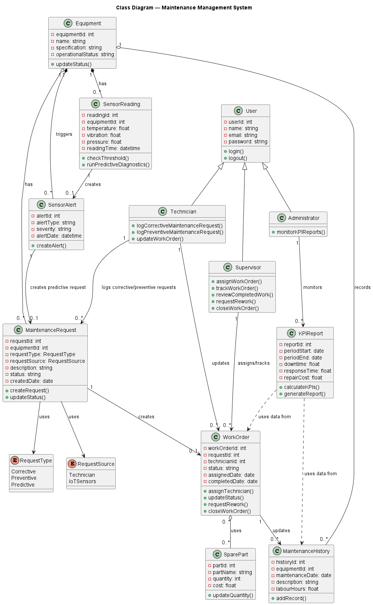

### Key Elements

- **Core Classes**: User, Technician, Supervisor, Administrator
- **Domain Classes**: Equipment, MaintenanceRequest, WorkOrder, MaintenanceHistory, SparePart, SensorReading, SensorAlert, KPIReport

### Relationships

- **Inheritance**: Technician, Supervisor, and Administrator inherit from User.
- **Composition**: Equipment is composed of SensorReading and SensorAlert objects.
- **Aggregation**: Equipment records MaintenanceHistory and has MaintenanceRequests.
- **Associations**:
  - Technician logs maintenance requests and updates work orders.
  - Supervisor assigns and tracks work orders.
  - Administrator monitors KPI reports.
  - SensorAlert creates a MaintenanceRequest.
  - KPIReport uses data from WorkOrder and MaintenanceHistory.

This diagram ensures a clear representation of system structure, including attributes, operations, inheritance, aggregation, composition, and associations.

---

# 6. Behavioral Modeling

## 6.1 System Type

The system is classified as a **hybrid system**:

- **Data-driven**: manages maintenance requests, work orders, equipment records, spare parts inventory, maintenance history, and KPI reports.
- **Event-driven**: responds to workflow events such as assignment, completion, rework, and abnormal IoT sensor readings.

Since the system has both data-driven and event-driven behavior, the **State Diagram** was selected as the most representative behavioral model. This is because the lifecycle of a work order is strongly state-based and changes in response to clear events.

---

## 6.2 State Diagram — Work Order Lifecycle

The state diagram models the lifecycle of a work order.

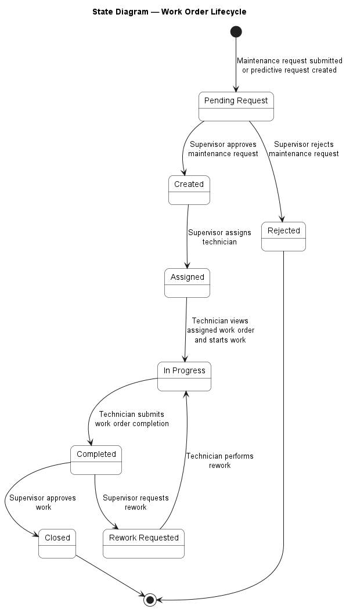

### States

- Pending Request
- Created
- Assigned
- In Progress
- Completed
- Rework Requested
- Closed
- Rejected

The diagram shows how work orders transition between states based on events such as supervisor approval, technician assignment, work completion, supervisor review, and rework requests.

---

## 6.3 State-Stimulus Table

### Work Order Lifecycle

| Current State | Stimulus / Event | Action / Response | Next State |
|---|---|---|---|
| — | Maintenance request is submitted or predictive request is created | System stores the request with status pending and prepares it for supervisor review | Pending Request |
| Pending Request | Supervisor approves maintenance request | System creates a work order and prepares it for assignment | Created |
| Pending Request | Supervisor rejects maintenance request | System updates the request status and sends rejection notification | Rejected |
| Created | Supervisor assigns technician | System records the technician assignment and sends work order notification | Assigned |
| Assigned | Technician views assigned work order and starts work | System displays work order details and marks the work order as active | In Progress |
| In Progress | Technician submits work order completion | System records maintenance history, labour hours, parts used, updates equipment status, deducts spare parts, and notifies supervisor | Completed |
| Completed | Supervisor reviews and approves completed work | System closes the work order and updates KPI reports | Closed |
| Completed | Supervisor is not satisfied and requests rework | System records rework notes and sends rework notification to technician | Rework Requested |
| Rework Requested | Technician performs rework | System reopens the work order for active maintenance | In Progress |
| Closed | — | Terminal state — no further transitions | — |
| Rejected | — | Terminal state — no further transitions | — |

The table defines the triggering events, system responses, and resulting state transitions. It complements the state diagram by providing detailed behavioral rules for the work order lifecycle.

---

# 7. Summary and Conclusions

## 7.1 System Summary

The Maintenance Management System provides an integrated solution for managing maintenance operations efficiently and reliably. It supports manual maintenance requests, automated sensor-based alerts, work order tracking, spare parts updates, and KPI reporting.

---

## 7.2 Key Features

- Predictive maintenance using IoT sensors
- Real-time work order tracking
- Automated notifications
- Maintenance history logging
- Spare parts inventory updates
- KPI monitoring and reporting

---

## 7.3 Future Improvements

- AI-based predictive analytics
- Mobile application support
- Advanced reporting dashboards
- Integration with external inventory suppliers
- More detailed cost analysis and forecasting

---

# Appendix

## Tools Used

- PlantUML
- GitHub
- VS Code
- Markdown

---

**Version:** 2.0  
**Semester:** Spring 2026
