# Software-engineering-project

## 1. Group Info

**Group Number:** Group 01  

**Case Study:** 

Maintenance Management System  

**Student IDs + Names:**

20210748 — Mira Nibal Hindawi  
20210611 — Osama Eltayyeb Alameen  
20210853 — Zina Maher Alhijazeen  
20220637 — Zakaria Zakarya Alkashef  

**Course + Instructor:** 

Software Engineering — Dr. Samer Elkababji  

## 2. Overview

### System Purpose

The Maintenance Management System (MMS) is designed to manage and track maintenance operations in industrial, commercial, or institutional environments.

The system supports:

- Corrective maintenance requests logged by technicians when equipment faults or breakdowns occur
- Preventive maintenance requests logged by technicians for scheduled or routine maintenance
- Predictive maintenance alerts triggered by abnormal IoT sensor readings

The system helps reduce downtime, improve maintenance tracking, manage spare parts, and support KPI monitoring such as downtime, response time, and repair cost.

### Tools Used

- PlantUML
- Markdown
- GitHub
- Visual Studio Code 
- Pandoc


## 3. Diagrams

- **Context Diagram (C4 Level 1):** Shows the system boundary and how technicians, supervisors, administrators, IoT sensors, and the notification service interact with MMS.

- **Container Diagram (C4 Level 2):** Shows the internal architecture of MMS, including the Web Application, Backend API, Database, IoT Sensors, and Notification Service.

- **Activity Diagrams:** Show the maintenance workflows separated into corrective, preventive, and predictive maintenance.

- **Use Case Diagram:** Shows the main system functionalities and how each actor interacts with them.

- **Use Case Descriptions:** Provide tabular descriptions for each use case, including actors, preconditions, postconditions, main flows, extensions, and included use cases.

- **Sequence Diagrams:** Show the interaction flow for each use case.
  - **High-Level Sequence Diagrams:** Show stakeholder-level communication between actors, MMS, and external systems.
  - **Detailed Sequence Diagrams:** Show developer-level processing between the Web Application, Backend API, Database, and Notification Service.

- **Class Diagram:** Represents the static structure of the system, including classes, attributes, operations, inheritance, associations, aggregation, and composition.

- **State Diagram:** Models the lifecycle of a maintenance request and work order from pending request to closure, including rework when needed.

- **State-Stimulus Table:** Describes the events, actions, and next states for the work order lifecycle.


## 4. Repo Structure

```text
      /docs
        se_report_group_01.md
        se_report_group_01.pdf

      /uml
        Context/
          context_diagram.puml
          container_diagram.puml
          activity_diagrams/

        Interactions/
          usecase_diagram.puml
          usecase_description.md
          sequence_diagrams/

        Structure/
          class_diagram.puml

        Behavior/
          state_diagram.puml
          state_stimulus_table.md
      
      Commit hub
      README.md
```


## 5. Contributions

### Member Roles

- Osama — C4 Diagrams and Activity Diagrams  
- Mira — Use Case Diagram and Use Case Descriptions  
- Zina — Sequence Diagrams  
- Zakaria — Class Diagram and State Diagram  

### Commit Count

| Member | Commits |
|---|---:|
| Osama | 15 |
| Mira | 39 |
| Zina | 14 |
| Zakaria | 11 |

\newpage

# 1. Project Overview

## 1.1 System Purpose

The Maintenance Management System (MMS) is designed to help organizations carry out maintenance activities more efficiently. It allows technicians to log corrective and preventive maintenance requests, supervisors to assign and track work orders, and administrators to evaluate system performance through KPI reports.

The system also supports predictive maintenance by receiving abnormal readings from IoT sensors. This helps detect potential equipment issues early, reduce downtime, and improve response time.


## 1.2 System Scope

The system has several important features that facilitate the maintenance process:

- Managing corrective maintenance requests logged by technicians during equipment faults or breakdowns.

- Managing preventive maintenance requests logged by technicians for scheduled or routine maintenance.

- Handling predictive maintenance alerts generated from abnormal IoT sensor readings.

- Creating, assigning, and tracking work orders to ensure maintenance tasks are completed efficiently.

- Recording maintenance history and logging labour hours, parts used, and work order updates.

- Managing spare parts inventory to ensure availability during maintenance tasks.

- Generating KPI reports such as downtime, response time, and maintenance costs.

- Sending notifications and alerts to keep supervisors and technicians informed about requests, assignments, completion, and rework.


# 2. Context, Container, and Activity Diagrams

## 2.1 Context Diagram

The Context Diagram defines the overall boundary of the Maintenance Management System (MMS) and shows how it interacts with different users and external systems.
It provides a high-level view of the system, highlighting how MMS acts as the central platform that connects all actors and manages maintenance operations.


**Figure 1:** C4 Level 1 Context Diagram

All entities interacting with MMS are categorized based on their roles:

### 1. Internal Actors 

- **Technician**: Logs corrective and preventive maintenance requests, updates work orders, and records maintenance activities.

- **Supervisor**: Assigns technicians, tracks work order progress, reviews completed work, requests rework if needed, and closes work orders.

- **Administrator**: Monitors system performance through KPI reports such as downtime, response time, and repair cost.

### 2. External Systems

- **IoT Sensors**: Continuously monitor equipment conditions and send abnormal readings to the system for predictive maintenance.

- **Notification Service**: Sends system-generated alerts and notifications, including maintenance request notifications, work order notifications, completion notifications, and rework notifications.

The context diagram clearly indicates that MMS is a central system that facilitates communication between users and external services. It helps in understanding the flow of information both inside and outside the system, controlling all interactions.


## 2.2 Container Diagram

The Container Diagram presents a high-level view of the internal structure of the Maintenance Management System (MMS). It shows how the system is divided into major components and how these components interact with each other.

This diagram helps in understanding how responsibilities are distributed across the system and how data flows between different parts.


**Figure 2:** C4 Level 2 Container Diagram


The system is composed of the following main containers:

### 1. Web Application (Frontend)

- Provides the user interface for technicians, supervisors, and administrators.

- Allows technicians to log corrective and preventive maintenance requests and update work orders.

- Allows supervisors to assign and track work orders.

- Allows administrators to view KPI reports.

### 2. Backend API (Application Server)

- Handles business logic and system processing.

- Manages workflows such as corrective and preventive maintenance requests, work order creation, sensor alert processing, predictive diagnostics, and KPI calculations.

- Coordinates communication between the frontend, database, IoT sensors, and notification service.

### 3. Database

- Stores system data including:
  - Users
  - Equipment records
  - Maintenance requests
  - Work orders
  - Maintenance history
  - Spare parts inventory
  - Sensor alerts
  - KPI data

### 4. External Systems

- **IoT Sensors**: Send real-time equipment readings for predictive maintenance.

- **Notification Service**: Sends alerts and system notifications to users.

The container diagram illustrates how the system follows a layered architecture, where each component has a specific responsibility. The frontend handles user interaction, the backend manages logic and processing, and the database stores all system data.
This separation improves system organization, scalability, and maintainability.


## 2.3 Activity Diagrams

The activity diagrams illustrate the maintenance workflows supported by the Maintenance Management System (MMS). The workflows are separated into three maintenance types: corrective, preventive, and predictive maintenance. This separation makes each workflow clearer and avoids combining different maintenance triggers in one diagram.


### 2.3.1 Corrective Maintenance Workflow

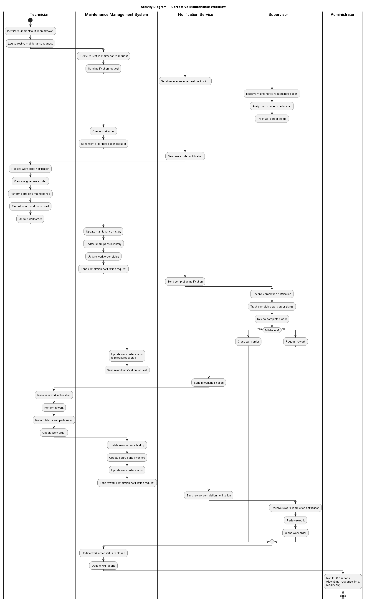{ height=7.6in }

**Figure 3:** Corrective Maintenance Activity Diagram

The corrective maintenance workflow starts when a technician identifies an equipment fault or breakdown and logs a corrective maintenance request. The system creates the request and sends a notification through the Notification Service to the supervisor.

After receiving the notification, the supervisor assigns a work order to a technician and tracks the work order status. The technician receives the work order notification, views the assigned work order, performs corrective maintenance, records labour and parts used, and updates the work order.

The system updates the maintenance history, spare parts inventory, and work order status, then sends a completion notification to the supervisor. The supervisor reviews the completed work and either closes the work order or requests rework. After the work order is closed, the system updates KPI reports.


### 2.3.2 Preventive Maintenance Workflow

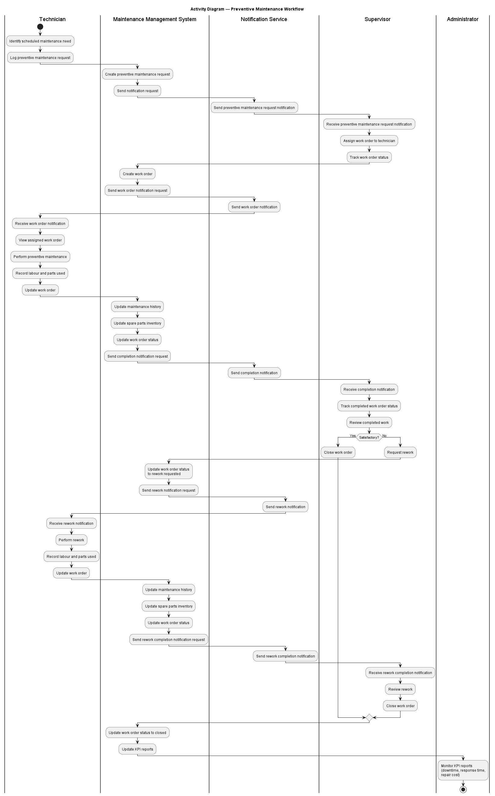{ height=7.6in }

**Figure 4:** Preventive Maintenance Activity Diagram

The preventive maintenance workflow starts when a technician identifies a scheduled or routine maintenance need and logs a preventive maintenance request. The system creates the request and sends a notification to the supervisor.


The supervisor assigns a work order to a technician and tracks its status. The technician receives the work order notification, performs preventive maintenance, records labour and parts used, and updates the work order.

The system updates the maintenance history, spare parts inventory, and work order status, then sends a completion notification to the supervisor. The supervisor reviews the completed work and either closes the work order or requests rework. When the work order is closed, KPI reports are updated.


### 2.3.3 Predictive Maintenance Workflow

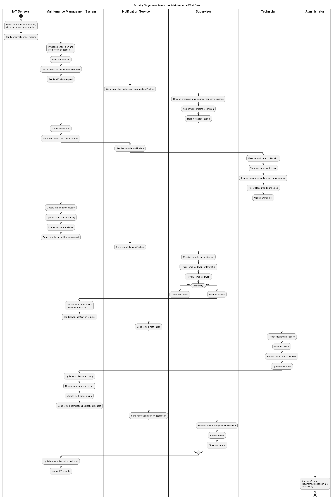{ height=7.6in }

**Figure 5:** Predictive Maintenance Activity Diagram


The predictive maintenance workflow starts when IoT sensors detect abnormal temperature, vibration, or pressure readings. The sensors send the abnormal reading to the system, where the Backend API performs threshold checking and predictive diagnostics.

If the reading is abnormal, the system stores a sensor alert and creates a predictive maintenance request. The system then sends a notification through the Notification Service to the supervisor.

The supervisor assigns a work order to a technician and tracks the work order status. The technician receives the work order notification, inspects the equipment, performs the required maintenance, records labour and parts used, and updates the work order.

The system updates the maintenance history, spare parts inventory, and work order status, then sends a completion notification to the supervisor. The supervisor reviews the completed work and either closes the work order or requests rework. After closure, KPI reports are updated.


# 3. Use Case Models and Interaction Design

## 3.1 Use Case Diagram

The use case diagram shows the interaction between various actors and the Maintenance Management System (MMS) to carry out important operations. It gives an overview of the system from the user's point of view.
This diagram assists in understanding the key system components and how each actor (technician, supervisor, administrator, sensors in IoT, notification service) performs various activities in the system.

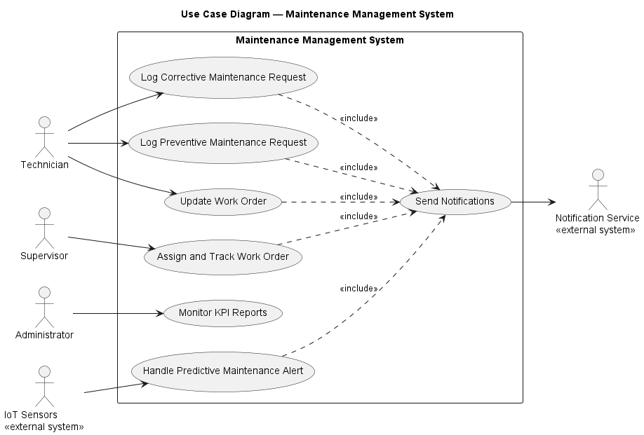

**Figure 6:** Use Case Diagram

The diagram shows the main system functions and their interactions with the actors. The main use cases are logging corrective maintenance requests, logging preventive maintenance requests, assigning and tracking work orders, updating work orders, handling predictive maintenance alerts, and monitoring KPI reports.


## 3.2 Use Case Descriptions

### UC1 — Log Corrective Maintenance Request
**Table 1:** UC1 — Log Corrective Maintenance Request Description

| Field | Description |
|---|---|
| **Use Case ID** | UC1 |
| **Use Case Name** | Log Corrective Maintenance Request |
| **Actor(s)** | Technician |
| **Description** | A technician logs a corrective maintenance request when equipment has a fault, breakdown, or issue that requires repair. |
| **Preconditions** | Technician is authenticated. Equipment record exists in the system. |
| **Postconditions** | Corrective maintenance request is stored and supervisor is notified. |
| **Main Flow** | 1. Technician identifies equipment fault or breakdown. 2. Technician enters corrective request details. 3. System validates the request data. 4. System stores the corrective maintenance request. 5. System sends a new request notification to the supervisor. 6. Technician receives confirmation. |
| **Extensions** | Invalid or missing request details → system shows an error → technician corrects and resubmits. |
| **Includes** | Send Notifications |

This use case is significant because it enables formal reporting of equipment faults and breakdowns and transforms them into maintenance activities.

---

### UC2 — Log Preventive Maintenance Request
**Table 2:** UC2 — Log Preventive Maintenance Request Description

| Field | Description |
|---|---|
| **Use Case ID** | UC2 |
| **Use Case Name** | Log Preventive Maintenance Request |
| **Actor(s)** | Technician |
| **Description** | A technician logs a preventive maintenance request for scheduled or routine maintenance before equipment failure occurs. |
| **Preconditions** | Technician is authenticated. Equipment record exists in the system. Scheduled maintenance need is identified. |
| **Postconditions** | Preventive maintenance request is stored and supervisor is notified. |
| **Main Flow** | 1. Technician identifies scheduled maintenance need. 2. Technician enters preventive request details. 3. System validates the request data. 4. System stores the preventive maintenance request. 5. System sends a new request notification to the supervisor. 6. Technician receives confirmation. |
| **Extensions** | Invalid or missing request details → system shows an error → technician corrects and resubmits. |
| **Includes** | Send Notifications |

The significance of this use case is that it enables the scheduling of maintenance activities and helps to prevent failures before they happen.

---

### UC3 — Assign and Track Work Order
**Table 3:** UC3 — Assign and Track Work Order Description

| Field | Description |
|---|---|
| **Use Case ID** | UC3 |
| **Use Case Name** | Assign and Track Work Order |
| **Actor(s)** | Supervisor |
| **Description** | A supervisor assigns a maintenance request as a work order to a technician and tracks the work order status after a valid assignment. |
| **Preconditions** | Supervisor is authenticated. A maintenance request exists. |
| **Postconditions** | If the assignment is valid, a work order is created, the technician is notified, and the supervisor can track the work order status. |
| **Main Flow** | 1. Supervisor receives a maintenance request notification. 2. Supervisor selects the maintenance request and technician. 3. System validates the assignment. 4. System creates the work order. 5. System sends a work order notification to the technician. 6. System confirms the assignment to the supervisor. 7. Supervisor views and tracks the work order status. |
| **Extensions** | Invalid assignment or technician unavailable → system shows an error message → work order is not created until the assignment is corrected. |
| **Includes** | Send Notifications |

This use case ensures that maintenance requests are assigned to technicians and tracked until completion.

---

### UC4 — Update Work Order
**Table 4:** UC4 — Update Work Order Description

| Field | Description |
|---|---|
| **Use Case ID** | UC4 |
| **Use Case Name** | Update Work Order |
| **Actor(s)** | Technician |
| **Description** | A technician updates an assigned work order to show progress, completion, labour hours, and parts used. The system updates related records to keep data consistent. |
| **Preconditions** | Technician is authenticated. Work order is assigned to the technician. |
| **Postconditions** | Work order, maintenance history, spare parts inventory, and work order status are updated. Supervisor is notified. |
| **Main Flow** | 1. Technician views assigned work order. 2. Technician performs maintenance work. 3. Technician records labour and parts used. 4. Technician submits the work order update. 5. System validates the update details. 6. System updates the work order. 7. System updates maintenance history and spare parts inventory. 8. System sends a completion notification to the supervisor. 9. Technician receives confirmation. |
| **Extensions** | Invalid or missing update details → system shows an error → technician corrects and resubmits. Supervisor requests rework → technician performs rework and updates the work order again. |
| **Includes** | Send Notifications |

This use case ensures that maintenance work is recorded accurately and that work order progress is reflected in the system.

---

### UC5 — Handle Predictive Maintenance Alert
**Table 5:** UC5 — Handle Predictive Maintenance Alert Description

| Field | Description |
|---|---|
| **Use Case ID** | UC5 |
| **Use Case Name** | Handle Predictive Maintenance Alert |
| **Actor(s)** | IoT Sensors |
| **Description** | IoT sensors send abnormal equipment readings to the system. The system processes the readings, stores the sensor alert, and creates a predictive maintenance request. |
| **Preconditions** | IoT sensors are active. Equipment record exists in the system. |
| **Postconditions** | If the reading is abnormal, sensor alert and predictive maintenance request are stored, and supervisor is notified. |
| **Main Flow** | 1. IoT sensors detect abnormal temperature, vibration, or pressure reading. 2. IoT sensors send the abnormal sensor reading to the system. 3. System validates the sensor data. 4. System performs threshold checking and predictive diagnostics. 5. System stores the sensor alert. 6. System creates a predictive maintenance request. 7. System sends a predictive maintenance request notification to the supervisor. |
| **Extensions** | Invalid sensor data → system ignores the reading or returns an error. Normal reading → system stores the sensor reading only and no alert is created. |
| **Includes** | Send Notifications |

This use case allows the system to detect potential equipment problems early using IoT sensor data.

---

### UC6 — Monitor KPI Reports
**Table 6:** UC6 — Monitor KPI Reports Description

| Field | Description |
|---|---|
| **Use Case ID** | UC6 |
| **Use Case Name** | Monitor KPI Reports |
| **Actor(s)** | Administrator |
| **Description** | Administrator monitors KPI reports such as downtime, response time, and repair cost. |
| **Preconditions** | Administrator is authenticated. |
| **Postconditions** | KPI reports are displayed to the administrator. |
| **Main Flow** | 1. Administrator opens KPI dashboard. 2. System retrieves maintenance data. 3. System calculates KPIs such as downtime, response time, and maintenance costs. 4. System displays KPI reports. |
| **Extensions** | No maintenance data available → system displays an empty KPI report message. |
| **Includes** | None |

This use case is important because it provides administrators with insights into maintenance performance and helps support better decision-making.

---

# 4. Sequence Diagrams

## 4.1 High-Level Sequence Diagrams (Stakeholders)

The following high-level sequence diagrams describe the communication process between users, the Maintenance Management System (MMS), and external systems such as the Notification Service. They demonstrate the flow of information and data throughout the core processes.

### UC1 — Log Corrective Maintenance Request

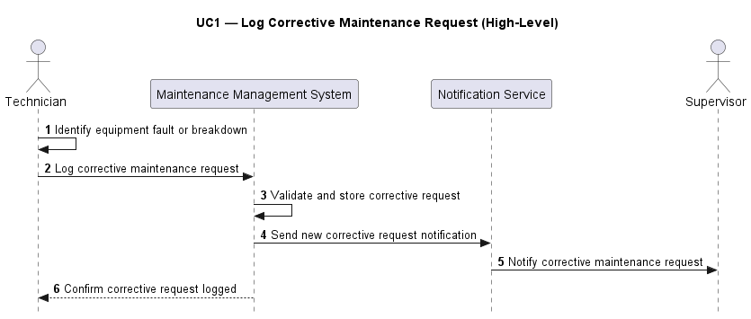

**Figure 7:** UC1 High-Level Corrective Maintenance Request Sequence Diagram

The UC1 high-level sequence diagram shows how a technician identifies an equipment fault or breakdown and logs a corrective maintenance request. The system validates and stores the request, sends a corrective request notification to the supervisor, and confirms the request to the technician.

---

### UC2 — Log Preventive Maintenance Request

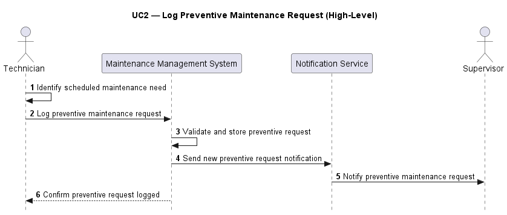

**Figure 8:** UC2 High-Level Preventive Maintenance Request Sequence Diagram

The UC2 high-level sequence diagram shows how a technician identifies a scheduled maintenance need and logs a preventive maintenance request. The system validates and stores the request, sends a preventive request notification to the supervisor, and confirms the request to the technician.

---

### UC3 — Assign and Track Work Order

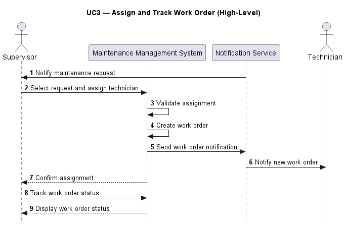

**Figure 9:** UC3 High-Level Assign and Track Work Order Sequence Diagram

The UC3 high-level sequence diagram shows how the supervisor receives a maintenance request notification, selects the request, assigns a technician, and tracks the work order status. The system validates the assignment, creates the work order, and sends a work order notification to the technician.

---

### UC4 — Update Work Order

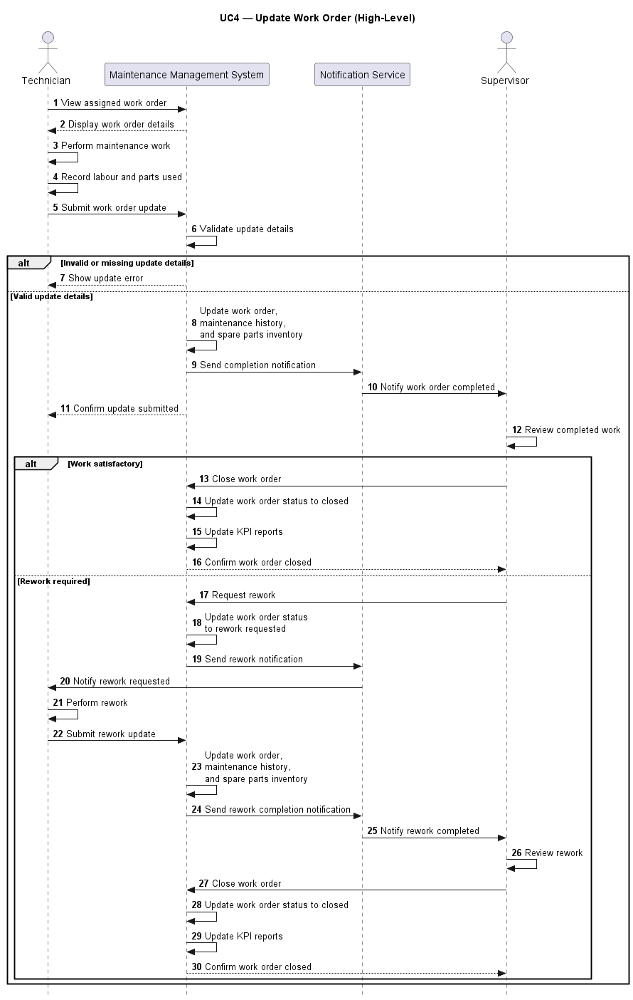

**Figure 10:** UC4 High-Level Update Work Order Sequence Diagram

The UC4 high-level sequence diagram shows how the technician views and updates an assigned work order after maintenance work is performed. The system updates the work order, maintenance history, and spare parts inventory, then sends a completion notification to the supervisor and confirms the update to the technician.

---

### UC5 — Handle Predictive Maintenance Alert

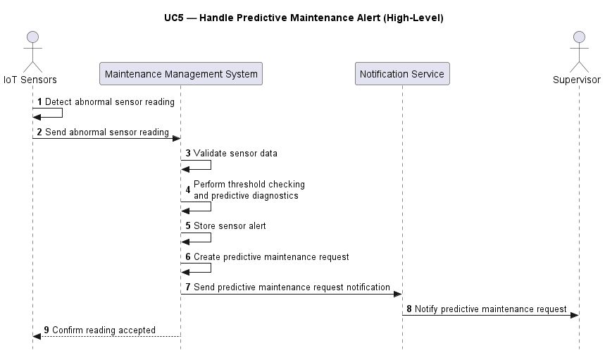

**Figure 11:** UC5 High-Level Predictive Maintenance Alert Sequence Diagram

The UC5 high-level sequence diagram shows how IoT sensors detect and send abnormal readings to the system. The system validates the sensor data, performs threshold checking and predictive diagnostics, stores the sensor alert, creates a predictive maintenance request, and notifies the supervisor.

---

### UC6 — Monitor KPI Reports

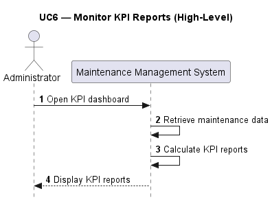

**Figure 12:** UC6 High-Level Monitor KPI Reports Sequence Diagram

The UC6 high-level sequence diagram shows how the administrator opens the KPI dashboard and receives KPI reports generated by the system.

---

## 4.2 Detailed Sequence Diagrams (Developers)

The detailed sequence diagrams provide a developer-level view of system interactions. These diagrams include internal components such as:

- Web Application

- Backend API

- Database

- Notification Service

They show validation, database operations, system processing, notification handling, and important alternative flows.

### UC1 — Log Corrective Maintenance Request


**Figure 13:** UC1 Detailed Corrective Maintenance Request Sequence Diagram

The UC1 detailed sequence diagram shows how the Web Application sends a corrective maintenance request to the Backend API, how the request is validated and stored in the database, and how the Notification Service is triggered to notify the supervisor.

---

### UC2 — Log Preventive Maintenance Request

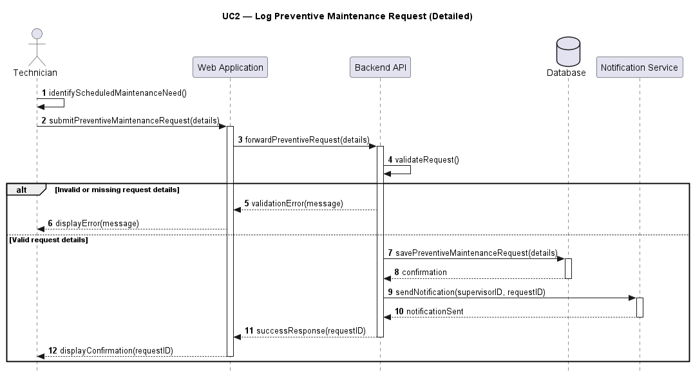

**Figure 14:** UC2 Detailed Preventive Maintenance Request Sequence Diagram

The UC2 detailed sequence diagram shows how the Web Application sends a preventive maintenance request to the Backend API, how the request is validated and stored in the database, and how the Notification Service is triggered to notify the supervisor.

---

### UC3 — Assign and Track Work Order

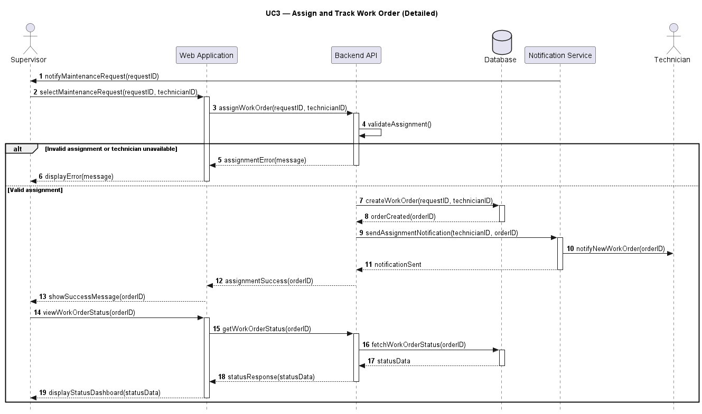

**Figure 15:** UC3 Detailed Assign and Track Work Order Sequence Diagram

The UC3 detailed sequence diagram shows how the supervisor assigns a work order through the Web Application. The Backend API validates the assignment, creates the work order in the database, triggers a notification to the technician, and later retrieves work order status for tracking.

---

### UC4 — Update Work Order

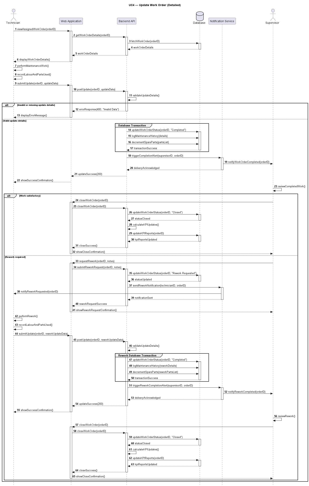{ height=7.8in }

**Figure 16:** UC4 Detailed Update Work Order Sequence Diagram

The UC4 detailed sequence diagram shows how the technician views an assigned work order, performs maintenance, records labour and parts used, and submits the update. The Backend API validates the update, updates the work order, maintenance history, and spare parts inventory, and sends a completion notification to the supervisor. It also shows the rework path when the supervisor requests rework.

---

### UC5 — Handle Predictive Maintenance Alert

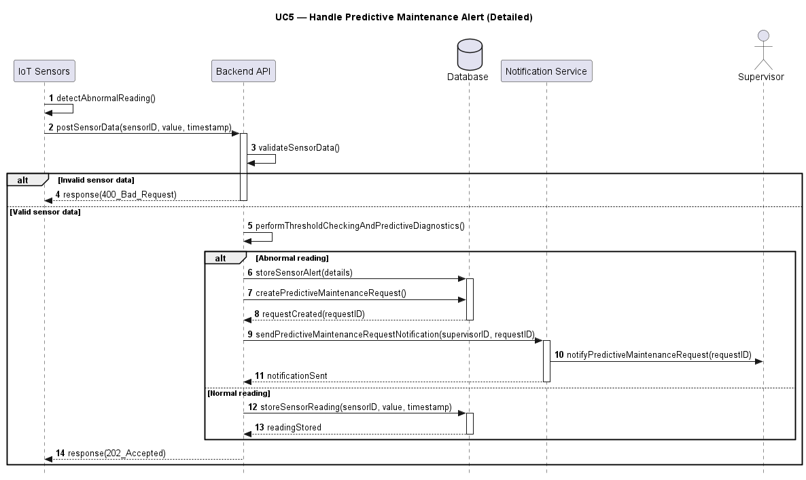

**Figure 17:** UC5 Detailed Predictive Maintenance Alert Sequence Diagram

The UC5 detailed sequence diagram shows how sensor readings are validated and processed. If the reading is abnormal, the system stores a sensor alert, creates a predictive maintenance request, and sends a notification to the supervisor. If the reading is normal, the system stores the sensor reading only.

---

### UC6 — Monitor KPI Reports

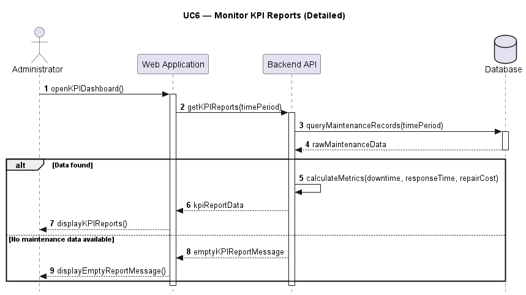

**Figure 18:** UC6 Detailed Monitor KPI Reports Sequence Diagram

The UC6 detailed sequence diagram shows how the administrator opens the KPI dashboard. The system reads maintenance data from the database, calculates KPIs, and returns KPI report data to the Web Application. If no maintenance data is available, the system displays an empty KPI report message.

---

# 5. Class Diagram (Structure)

The class diagram represents the static structure of the system.

{ width=95% }

**Figure 19:** Class Diagram

### Key Elements

- **Core Classes**: User, Technician, Supervisor, Administrator

- **Domain Classes**: Equipment, MaintenanceRequest, WorkOrder, MaintenanceHistory, SparePart, SensorReading, SensorAlert, KPIReport

- **Enumerations**: RequestType and RequestSource

### Relationships

- **Inheritance**: Technician, Supervisor, and Administrator inherit from User.

- **Composition**: Equipment is composed of SensorReading and SensorAlert objects.

- **Aggregation**: Equipment records MaintenanceHistory and has MaintenanceRequests.

- **Associations**:
  - Technician logs corrective and preventive maintenance requests and updates work orders.
  - Supervisor assigns and tracks work orders, reviews completed work, requests rework, and closes work orders.
  - Administrator monitors KPI reports.
  - SensorAlert creates a predictive MaintenanceRequest.
  - KPIReport uses data from WorkOrder and MaintenanceHistory.

The class diagram also includes the RequestType and RequestSource enumerations. RequestType identifies whether a maintenance request is corrective, preventive, or predictive. RequestSource identifies whether the request was created by a technician or triggered by IoT sensors.

This diagram ensures a clear representation of system structure, including attributes, operations, inheritance, aggregation, composition, associations, and enumerations.


# 6. Behavioral Modeling

## 6.1 System Type

The system is classified as a **hybrid system**:

- **Data-driven**: manages maintenance requests, work orders, equipment records, spare parts inventory, maintenance history, and KPI reports.

- **Event-driven**: responds to workflow events such as assignment, completion, rework, and abnormal IoT sensor readings.

Since the system has both data-driven and event-driven behavior, the State Diagram was selected as the most representative behavioral model. This is because the lifecycle of a work order is very state dependent and will change in response to clear events.


## 6.2 State Diagram — Maintenance Request and Work Order Lifecycle

The state diagram models the lifecycle starting from a pending maintenance request and continuing through work order creation, assignment, progress, completion, rework if needed, and closure.

{ height=7.2in }

**Figure 20:** State Diagram — Work Order Lifecycle

### States

- Pending Request
- Created
- Assigned
- In Progress
- Completed
- Rework Requested
- Closed

The diagram shows how work orders transition between states based on events such as technician assignment, work order creation, technician progress, completion, supervisor review of completed work, rework requests, and closure.


## 6.3 State-Stimulus Table

### Work Order Lifecycle
**Table 7:** State-Stimulus Table for Work Order Lifecycle

| Current State | Stimulus / Event | Action / Response | Next State |
|---|---|---|---|
| — | Corrective/preventive request is logged or predictive request is created | System stores the maintenance request with pending status and sends a notification to the supervisor | Pending Request |
| Pending Request | Supervisor selects request and assigns technician | System validates the assignment and creates a work order from the maintenance request | Created |
| Created | Work order is created successfully | System records the technician assignment and sends work order notification to the technician | Assigned |
| Assigned | Technician views assigned work order and starts work | System displays work order details and marks the work order as active | In Progress |
| In Progress | Technician submits work order completion | System records maintenance history, labour hours, parts used, updates spare parts inventory, updates work order status, and notifies supervisor | Completed |
| Completed | Supervisor reviews completed work and closes work order | System updates work order status to closed and updates KPI reports | Closed |
| Completed | Supervisor requests rework | System updates work order status to rework requested and sends rework notification to the technician | Rework Requested |
| Rework Requested | Technician performs rework | System reopens the work order for active maintenance | In Progress |
| Closed | — | Terminal state — no further transitions | — |

The table defines the triggering events, system responses, and resulting state transitions. It complements the state diagram by providing detailed behavioral rules for the work order lifecycle.

\newpage
# 7. Summary and Conclusions

## 7.1 System Summary

The Maintenance Management System provides an integrated solution for managing maintenance operations efficiently and reliably. It supports corrective, preventive, and predictive maintenance workflows, work order tracking, spare parts updates, automated notifications, rework handling, and KPI reporting.


## 7.2 Key Features

- Corrective maintenance request handling

- Preventive maintenance request handling

- Predictive maintenance using IoT sensors

- Real-time work order tracking

- Rework handling for incomplete or unsatisfactory work

- Automated notifications

- Maintenance history logging

- Spare parts inventory updates

- KPI monitoring and reporting


## 7.3 Future Improvements

- More advanced AI-based predictive analytics

- Mobile application support

- Automatic spare parts ordering

- Future maintenance cost prediction


